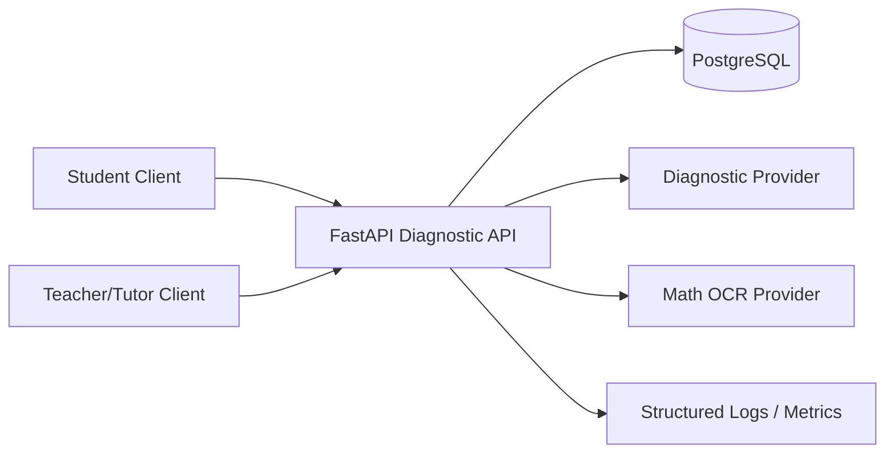
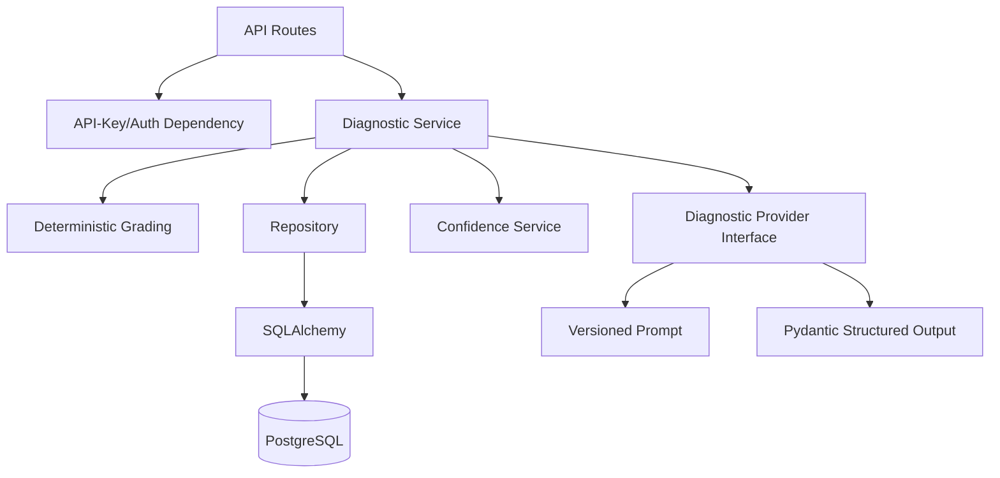
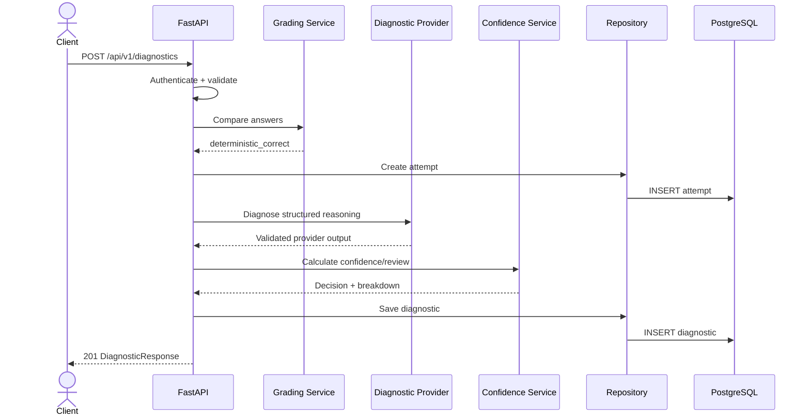
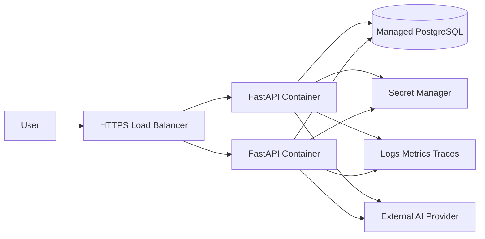

# Level 1 Architecture

## Context Diagram

## Component Diagram

## Create-Diagnostic Sequence

## Design Decisions

- Deterministic grading is authoritative for final-answer correctness because it is cheaper and more reproducible than LLM grading.
- Provider output uses strict Pydantic validation to keep prose from leaking into machine-consumed fields.
- Repository boundaries isolate persistence from business logic.
- Confidence is calculated outside the model so review behavior is auditable.
- Prompt and model versions are persisted for reproducibility.
- OCR fails closed in V1 to avoid pretending that unreliable handwriting extraction is production-ready.

## Deployment Architecture

