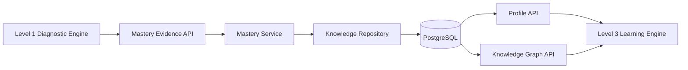
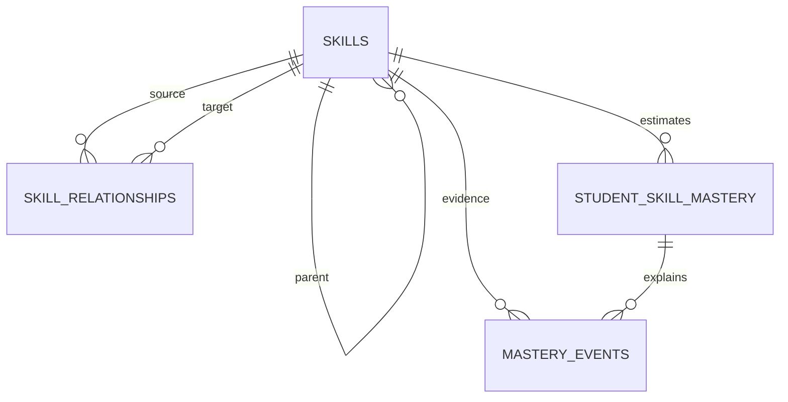

# Level 2 Engineering Specification — Student Knowledge Model

## 1. Architecture Decision

PostgreSQL remains the system of record. Skill relationships are modeled with an adjacency table and returned through graph-shaped APIs. Neo4j is deferred because the V1 access patterns are shallow, relational integrity is valuable, and operating a second database would not improve the portfolio demonstration enough to justify its complexity.

## 2. Components



## 3. Data Model



### `skills`
Canonical curriculum node with stable `code`, display name, domain, optional parent, and active flag.

### `skill_relationships`
Directed relationship between two skills. Types are `prerequisite_of`, `part_of`, and `related_to`.

### `student_skill_mastery`
Materialized current state for fast reads. Unique on `(student_id, skill_id)`.

### `mastery_events`
Append-only audit record. Unique on `(evidence_type, source_id, skill_id)` to guarantee idempotency.

## 4. Mastery Algorithm

V1 uses a transparent exponential evidence update:

```text
target = 1 for correct, 0 for incorrect
weight = base × confidence factor × difficulty factor
new_score = old_score + (target - old_score) × weight
```

- Correct base weight: `0.18`
- Incorrect base weight: `0.24`
- Confidence factor: `0.5 + 0.5 × diagnostic_confidence`
- Difficulty factors: easy `0.8`, medium `1.0`, hard `1.2`
- Maximum event weight: `0.35`
- Insufficient evidence halves the confidence factor.

Incorrect evidence is intentionally somewhat stronger because an observed misconception is useful remediation evidence. This is a product assumption that must be evaluated and calibrated before production.

Confidence is evidence-volume confidence, not prediction certainty:

```text
confidence = 1 - 0.75 ^ attempt_count
```

## 5. Status Thresholds

| Score | Status |
|---:|---|
| `< 0.20` | not_started |
| `< 0.40` | emerging |
| `< 0.65` | developing |
| `< 0.85` | proficient |
| `>= 0.85` | mastered |

## 6. API Contracts

### `POST /api/v1/skills`
Creates a curriculum skill. Conflict if code exists; 404 if parent is absent.

### `GET /api/v1/skills`
Lists active skills.

### `POST /api/v1/skill-relationships`
Creates a typed directed relationship. Self-links fail validation.

### `POST /api/v1/mastery/evidence`
Applies one evidence item transactionally and idempotently.

### `GET /api/v1/students/{student_id}/knowledge-profile`
Returns overall mastery, ranked strongest/weakest skills, and all observed skills.

### `GET /api/v1/students/{student_id}/knowledge-graph`
Returns curriculum nodes, relationships, and student-specific mastery state.

## 7. Integration with Level 1

The stable contract is `MasteryEvidenceInput`. Level 1 diagnostic results map as follows:

| Level 1 | Level 2 |
|---|---|
| `student_id` | `student_id` |
| `diagnostic_id` | `source_id` |
| `affected_skill` | `skill_code` |
| `correct` | `is_correct` |
| `confidence` | `diagnostic_confidence` |
| question difficulty | `difficulty` |
| `error_category` | `error_category` |

V1 exposes the evidence endpoint explicitly. A future event bus or outbox worker can automate this mapping without coupling the diagnostic transaction to mastery availability.

## 8. Failure Handling

- Missing skill: `404 SKILL_NOT_FOUND`
- Duplicate skill or relationship: `409 KNOWLEDGE_MODEL_CONFLICT`
- Duplicate evidence: return the existing event, preserving idempotency
- Invalid self-relationship: `422`
- Database conflict: rollback transaction

## 9. Security

Existing optional API-key protection applies through the application dependency architecture. Production should add role-based permissions:

- Students: read own profile
- Teachers: read assigned students
- Curriculum admins: mutate skills and relationships
- Internal services: submit evidence

## 10. Testing Strategy

- Unit tests for weight and status thresholds
- API tests for catalog and relationship creation
- Idempotency test for duplicate evidence
- Correct/incorrect update-direction tests
- Empty and populated profile tests
- Graph composition test
- Migration upgrade/downgrade test
- Regression tests for Level 1

## 11. Tradeoffs

### Relational graph versus Neo4j
Selected relational because queries are shallow and transactional consistency matters. Reconsider Neo4j only if multi-hop adaptive-path queries become a measured bottleneck.

### Event sourcing versus state only
Selected event plus materialized state. Events provide explainability; materialized state keeps reads simple.

### Transparent formula versus ML estimator
Selected transparent formula for V1. It is inspectable and testable. A calibrated model can replace the estimator behind the service interface later.
