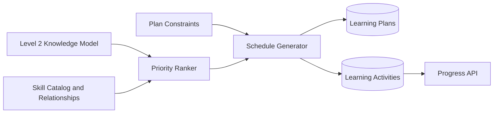
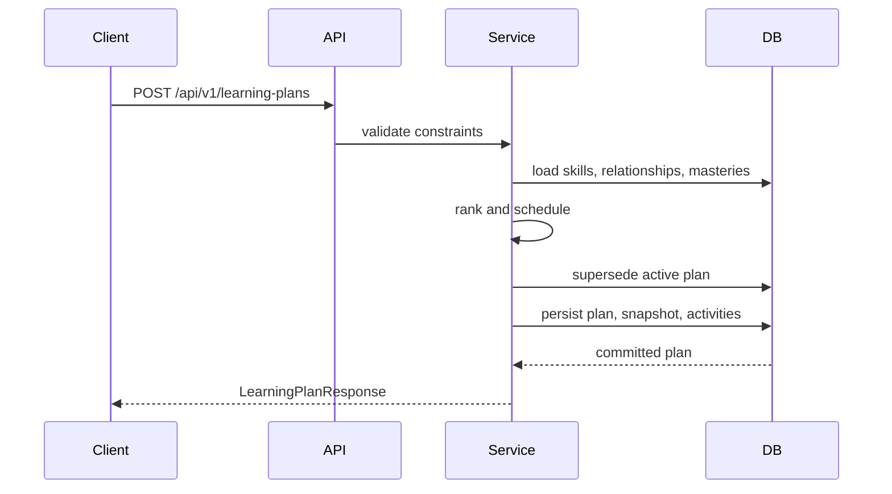

# Level 3 Engineering Specification — Personalized Learning Engine

## Architecture



## Generation Sequence



## Priority Formula

For each skill:

```text
priority =
  (1 - mastery_score) * 0.70
+ (1 - mastery_confidence) * 0.20
+ unseen_skill_bonus * 0.10
+ prerequisite_bonus
```

Unseen skills use mastery `0.50`, confidence `0.00`, and unseen bonus `1.00`. A prerequisite receives up to `0.08 × relationship_weight` when its dependent skill is weak.

## Activity Policy

- Final day: checkpoint.
- Mastery below 0.40: concept review, easy.
- Mastery below 0.65: guided practice, medium.
- Mastery below 0.85: independent practice, medium.
- Otherwise: mixed review, hard.

Question count is `max(3, daily_minutes // 5)`.

## Data Model

### learning_plans

Stores student, version, status, date range, constraints, algorithm version, mastery snapshot, generation metadata, supersession link, and timestamps.

### learning_activities

Stores the selected skill, date, sequence, type, difficulty, time budget, question count, rationale, priority, progress, and timestamps.

## API Contracts

### POST `/api/v1/learning-plans`

Creates and activates a new plan. Returns `201`. Supersedes the existing active plan.

### GET `/api/v1/learning-plans/{plan_id}`

Returns one immutable plan version. Returns `404 LEARNING_PLAN_NOT_FOUND` when missing.

### GET `/api/v1/students/{student_id}/active-learning-plan`

Returns the latest active plan.

### PATCH `/api/v1/learning-activities/{activity_id}`

Updates status and optional completed/correct counts. Validation rejects correct counts above completed counts.

## Error Handling

| Condition | HTTP | Code |
|---|---:|---|
| Empty skill catalog | 409 | `SKILL_CATALOG_EMPTY` |
| Missing plan | 404 | `LEARNING_PLAN_NOT_FOUND` |
| Missing activity | 404 | `LEARNING_ACTIVITY_NOT_FOUND` |
| Invalid dates or counts | 422 | FastAPI validation response |

## Security

Existing optional API-key protection remains available through project configuration. Production deployment should add student-resource authorization, rate limits, and audit events before exposing these endpoints externally.

## Testing Strategy

- Priority and activity-policy unit tests.
- API generation and retrieval tests.
- Supersession/version tests.
- Activity validation and progress tests.
- Regression execution of all Level 1 and Level 2 tests.
- Alembic upgrade/downgrade verification.

## Tradeoffs

V1 uses deterministic rules rather than an LLM recommender. This improves reproducibility, cost, latency, and interview explainability. Later experiments may compare learned ranking models, but only after sufficient outcome data exists.
