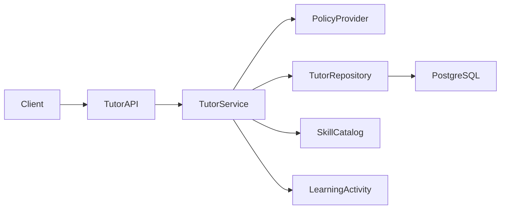
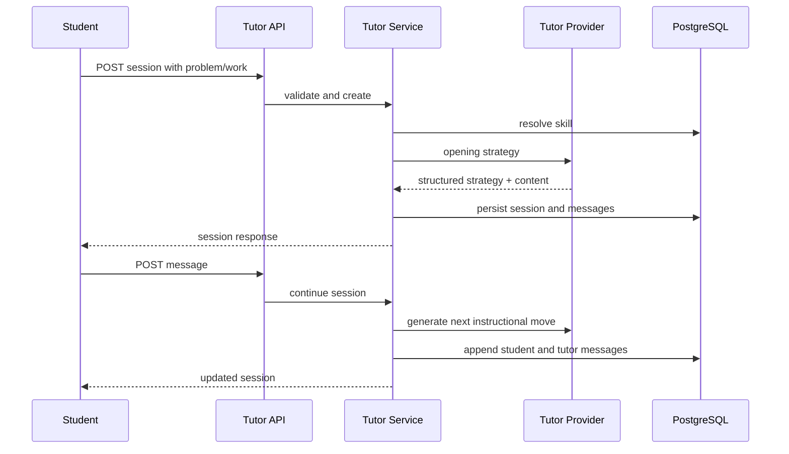

# Level 4 Engineering Specification — AI Tutor

## Architecture

## Sequence

## Components
- `schemas/tutor.py`: API contracts and enums.
- `models/tutor.py`: sessions, messages, and feedback.
- `repositories/tutor_repository.py`: persistence boundary.
- `services/tutor_service.py`: session state and instructional orchestration.
- `prompts/tutor_prompt.py`: versioned Socratic policy.
- `api/routes/tutor.py`: HTTP layer and typed error translation.

## Database
### tutor_sessions
Stores student, skill, optional learning activity, problem context, state, hint counters, provider version, and timestamps.

### tutor_messages
Append-oriented conversation events with role, instructional strategy, and monotonically increasing sequence.

### tutor_feedback
Stores helpfulness, rating, and comment.

## API Contracts
- `POST /api/v1/tutor/sessions` — create a session.
- `GET /api/v1/tutor/sessions/{id}` — retrieve complete conversation.
- `POST /api/v1/tutor/sessions/{id}/messages` — append student message and tutor response.
- `POST /api/v1/tutor/sessions/{id}/complete` — close session and optionally persist reflection.
- `POST /api/v1/tutor/sessions/{id}/feedback` — submit feedback.

## AI Policy
The provider must return a strategy and content. Production adapters must validate:
- one instructional move per response;
- no unsupported claims about student reasoning;
- no final answer before progressive-hint rules allow it;
- concise response;
- check-for-understanding where appropriate.

## Provider Strategy
V1 includes a deterministic `RuleBasedTutorProvider` so tests and demonstrations do not depend on an API key. The service boundary permits an OpenAI, Claude, or other provider later without changing endpoints or storage.

## Security
Production deployment must add user-scoped authorization, moderation, per-user rate limits, encrypted storage, retention controls, and redaction from operational logs. API-key authentication in the existing application remains an infrastructure hook, not student identity authorization.

## Error Handling
- `TUTOR_SESSION_NOT_FOUND` — 404.
- `TUTOR_SKILL_NOT_FOUND` — 404.
- `TUTOR_SESSION_CLOSED` — 409.
- Pydantic validation — 422.
- Future provider timeout — 503 with retry only before persistence.

## Testing
Unit-test provider policies and state transitions. API-test session creation, ordered messages, hint counting, completion, closed-session rejection, unknown skills, and feedback. Keep all Level 1–3 regression tests.

## Observability
Record request ID, endpoint, status, latency, provider, policy version, response strategy, hint count, and token/cost metrics for production providers. Never log raw student conversation text by default.

## Tradeoffs
PostgreSQL stores conversations instead of a separate message database because V1 volume is modest and transactional consistency is valuable. Synchronous responses keep the interface simple; streaming can be added after provider integration.
