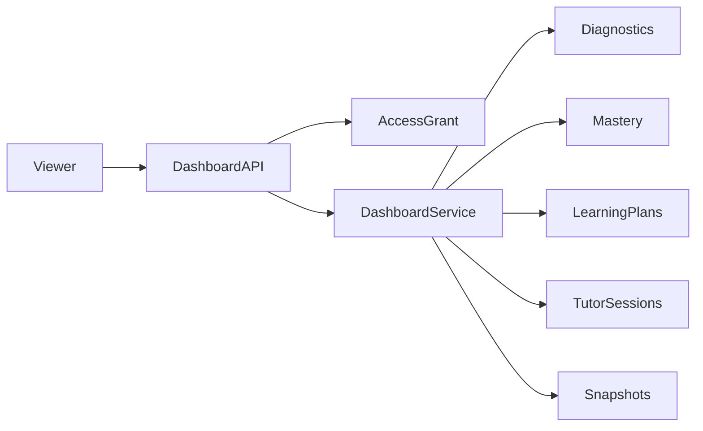

# Level 5 Engineering Specification — Teacher and Parent Dashboard

## Architecture
Level 5 is a read-model and reporting layer over Levels 1–4. `DashboardService` composes repository queries, applies authorization, derives metrics, creates alerts, and optionally persists daily snapshots.

## Authorization
V1 uses explicit `dashboard_access_grants(viewer_id, student_id, role)`. Admin access bypasses grants. This is an application authorization model, not full identity management; production should derive viewer identity and role from authenticated claims rather than query parameters.

## Data Model
### dashboard_access_grants
Auditable relationship between a viewer and student. Unique on viewer, student, and role.

### progress_snapshots
One materialized daily summary per student. Snapshots preserve historical trends even as current mastery changes.

## Metric Definitions
- Overall mastery: arithmetic mean of tracked skill mastery scores.
- Mastery confidence: arithmetic mean of tracked skill confidence.
- Diagnostic accuracy: correct diagnostic attempts / all diagnostic attempts.
- Plan completion: completed activities / all activities in the current active plan.
- Strength: mastery >= 0.75.
- Weak skill: mastery < 0.60.

These are transparent V1 policies, not validated psychometric measures.

## Alert Rules
- `LOW_EVIDENCE_CONFIDENCE`: average confidence below 0.35.
- `WEAK_SKILLS`: at least one skill below 0.60; severity is high below 0.35.
- `LOW_PLAN_COMPLETION`: active plan completion below 0.25.

## API Contracts
- `POST /api/v1/dashboard/access-grants`
- `GET /api/v1/dashboard/students/{student_id}`
- `GET /api/v1/dashboard/viewers/{viewer_id}/overview`
- `POST /api/v1/dashboard/students/{student_id}/snapshots`
- `GET /api/v1/dashboard/students/{student_id}/trends`

## Security
- Fail closed when no grant exists.
- Never return raw student answers, submitted work, or tutoring transcripts.
- Production must take viewer identity from authentication, add tenant/school boundaries, and log access events.

## Performance
V1 uses direct aggregate queries and relationship loading. At scale, add composite indexes, Redis caching, asynchronous snapshot jobs, and a reporting warehouse.

## Testing
- Authorized and unauthorized access.
- Aggregation from mastery evidence.
- Alert generation.
- Overview output.
- Snapshot idempotency and trends.
- Full regression suite.

## Tradeoffs
PostgreSQL remains the system of record. A separate analytics platform is deferred because V1 data volume does not justify operational complexity.
