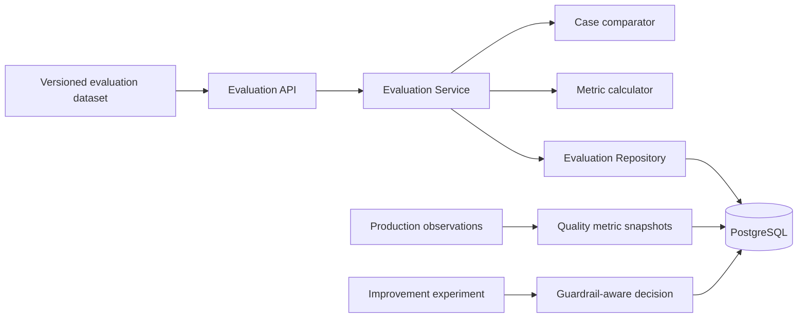

# Level 6 Engineering Specification

## Architecture
Level 6 adds a read/write evaluation subsystem behind `/api/v1/evaluation`.

## Data Model
- `evaluation_runs`: one versioned execution against a dataset.
- `evaluation_case_results`: immutable expected/actual comparisons.
- `quality_metric_snapshots`: periodic operational or product metrics.
- `improvement_experiments`: control/treatment hypotheses and decisions.

## Evaluation Workflow
1. Validate request with Pydantic.
2. Compare expected keys with actual values.
3. Apply optional minimum case score.
4. Persist case results.
5. Aggregate pass rate, mean score, mean latency, and cost.
6. Persist system and dataset versions.
7. Return a complete run result.

## Experiment Decision Policy
- Guardrail violation → `rollback`.
- Positive absolute lift and no violation → `promote`.
- Non-positive lift and no violation → `keep_control`.

This policy is transparent but intentionally not a substitute for statistical inference.

## API Contracts
- `POST /api/v1/evaluation/runs`
- `GET /api/v1/evaluation/runs`
- `GET /api/v1/evaluation/runs/{run_id}`
- `POST /api/v1/evaluation/metrics`
- `GET /api/v1/evaluation/metrics/{component}`
- `POST /api/v1/evaluation/experiments`
- `POST /api/v1/evaluation/experiments/{experiment_id}/complete`

## Security
Production deployments should restrict run creation and experiment completion to engineering or administrative roles. Evaluation payloads must not contain unnecessary student PII.

## Observability
Each run stores dataset version, system version, latency, and cost. Future telemetry adapters can populate metric snapshots without changing dashboard or AI feature contracts.

## Testing Strategy
- Unit-level metric and decision behavior through API tests.
- Integration persistence tests.
- Typed not-found errors.
- Full Levels 1–5 regression suite.
- Alembic upgrade, downgrade, and re-upgrade verification.

## Tradeoffs
V1 uses exact structured comparison because it is deterministic and explainable. Semantic graders, human review queues, bootstrap confidence intervals, and sequential tests are future enhancements.
